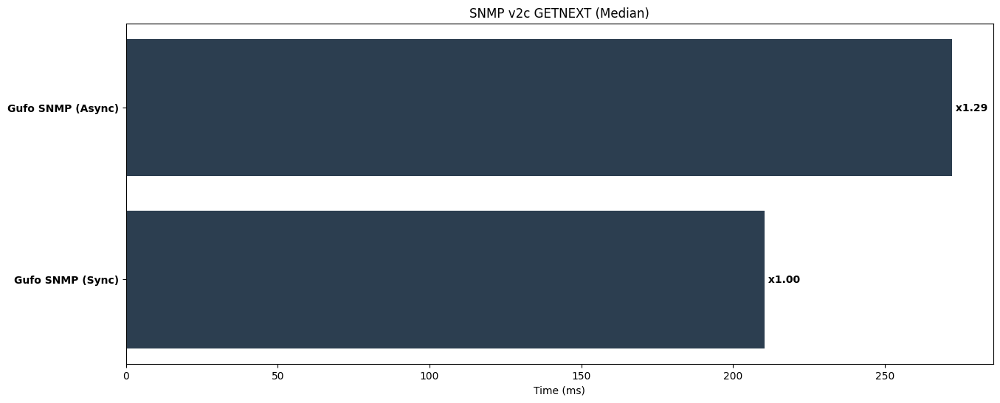
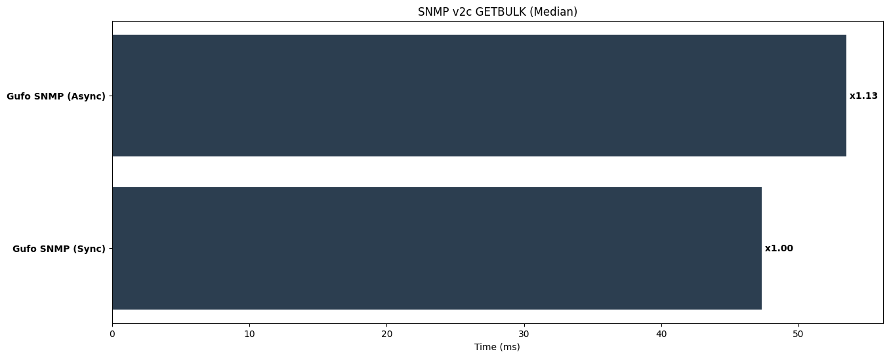
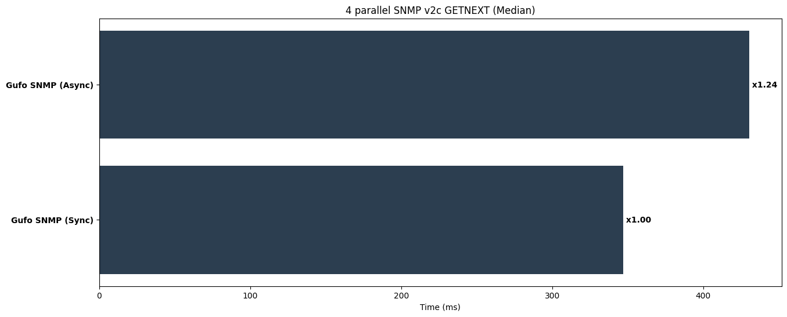
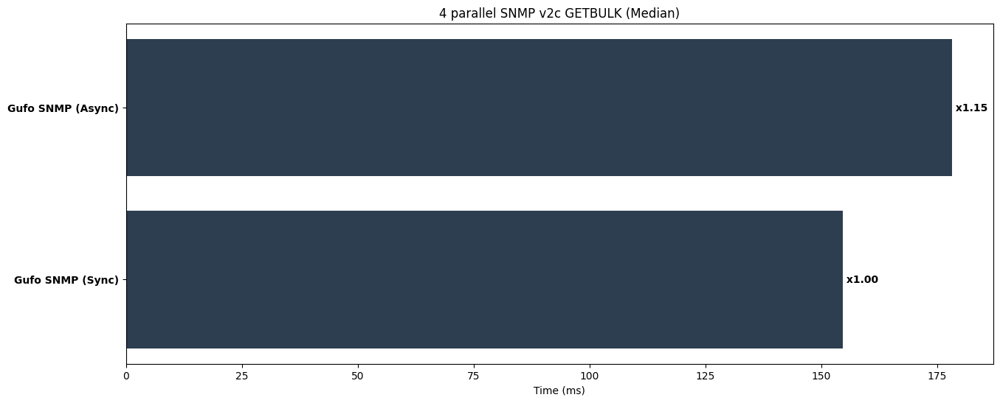
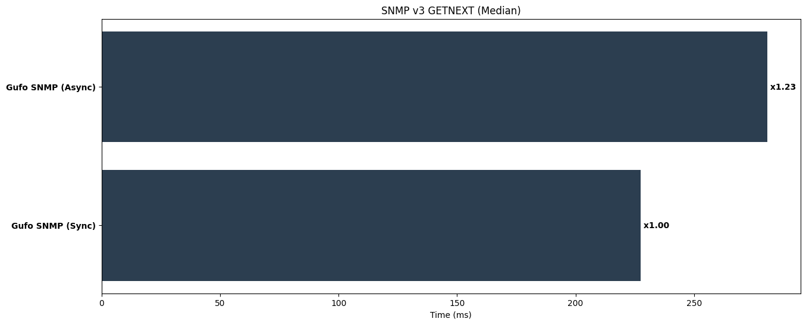
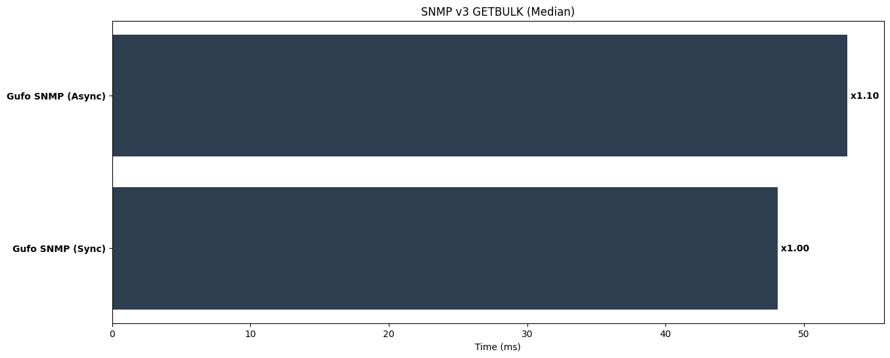
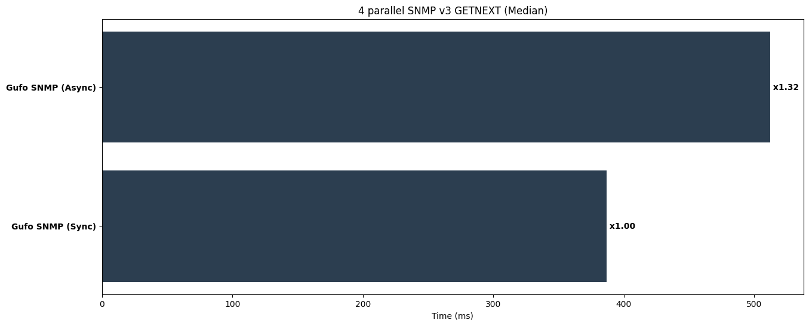
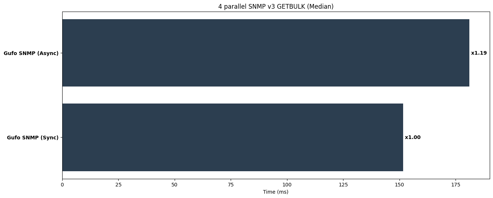

---
hide:
    - navigation
---
# Python SNMP Client Benchmarks
!!! warning "Disclaimer"

    All following information is provided only for reference.
    These tests are performed by [Gufo Labs][Gufo Labs] to estimate the performance
    of [Gufo SNMP][Gufo SNMP] against major competitors, so they cannot be considered
    independent and unbiased.

!!! note

    Although performance is an absolute requirement for [Gufo Stack][Gufo Stack],
    other factors such as maturity, community, features, examples, and existing code base
    should also be considered.

## Abstract
This benchmark evaluates several Python SNMP client libraries:

* [Gufo SNMP][Gufo SNMP] (current version)
* [pysnmp][pysnmp] (7.1.17)

The evaluation covers the following aspects:

* Performance in synchronous (blocking) mode, if supported.
* Performance in asynchronous (non-blocking) mode, if supported.
* Performance in plain-text SNMP (v2c) and encrypted (SNMP v3) modes.
* Ability to release GIL in multi-threaded applications.

All benchmarks are performed against a local Net-SNMPd installation
using wrapper, provided by `gufo.snmp.snmpd`.

The benchmarking environment utilizes an docker container running on
Apple M4 Pro processor.

## Preparing

Install local Net-SNMPd:

```
./tools/build/setup-snmpd.sh
```

Install dependencies:
```
pip install -r .requirements/test.txt -r .requirements/bench.txt gufo-snmp
```

## SNMP v2c

### GETNEXT

Perform SNMP v2c GETNEXT requests to iterate through whole MIB. This test evaluates:

* The efficiency of the network stack.
* The efficiency of BER encoder and decoder.
* The efficiency of the BER-to-Python data types mapping.

Run tests:

```
pytest benchmarks/test_v2c_getnext.py
```

**Results (lower is better)**

```
=============================================== test session starts ================================================
platform linux -- Python 3.13.2, pytest-8.3.3, pluggy-1.5.0
benchmark: 5.1.0 (defaults: timer=time.perf_counter disable_gc=False min_rounds=5 min_time=0.000005 max_time=1.0 calibration_precision=10 warmup=False warmup_iterations=100000)
rootdir: /workspaces/gufo_snmp
configfile: pyproject.toml
plugins: benchmark-5.1.0
collected 2 items                                                                                                  

benchmarks/test_v2c_getnext.py ..                                                                            [100%]


------------------------------------------------------------------------------------- benchmark: 2 tests ------------------------------------------------------------------------------------
Name (time in ms)             Min                 Max                Mean             StdDev              Median                IQR            Outliers     OPS            Rounds  Iterations
---------------------------------------------------------------------------------------------------------------------------------------------------------------------------------------------
test_gufo_snmp_sync      206.9305 (1.0)      213.5748 (1.0)      210.3227 (1.0)       2.8388 (1.0)      210.3246 (1.0)       4.8891 (1.0)           2;0  4.7546 (1.0)           6           1
test_gufo_snmp_async     221.5734 (1.07)     276.1817 (1.29)     262.2044 (1.25)     23.1550 (8.16)     272.0967 (1.29)     21.8713 (4.47)          1;0  3.8138 (0.80)          5           1
---------------------------------------------------------------------------------------------------------------------------------------------------------------------------------------------

Legend:
  Outliers: 1 Standard Deviation from Mean; 1.5 IQR (InterQuartile Range) from 1st Quartile and 3rd Quartile.
  OPS: Operations Per Second, computed as 1 / Mean
================================================ 2 passed in 4.59s =================================================
```


*Lower is better*

### GETBULK

Perform SNMP v2c GETBULK requests to iterate through whole MIB. This test evaluates:

* The efficiency of the network stack.
* The efficiency of BER encoder and decoder.
* The efficiency of the BER-to-Python data types mapping.

Run tests:

```
pytest benchmarks/test_v2c_getbulk.py
```

**Results (lower is better)**

```
=============================================== test session starts ================================================
platform linux -- Python 3.13.2, pytest-8.3.3, pluggy-1.5.0
benchmark: 5.1.0 (defaults: timer=time.perf_counter disable_gc=False min_rounds=5 min_time=0.000005 max_time=1.0 calibration_precision=10 warmup=False warmup_iterations=100000)
rootdir: /workspaces/gufo_snmp
configfile: pyproject.toml
plugins: benchmark-5.1.0
collected 2 items                                                                                                  

benchmarks/test_v2c_getbulk.py ..                                                                            [100%]


---------------------------------------------------------------------------------- benchmark: 2 tests ----------------------------------------------------------------------------------
Name (time in ms)            Min                Max               Mean            StdDev             Median               IQR            Outliers      OPS            Rounds  Iterations
----------------------------------------------------------------------------------------------------------------------------------------------------------------------------------------
test_gufo_snmp_sync      38.1624 (1.0)      49.0096 (1.0)      45.2748 (1.0)      4.2007 (1.68)     47.3390 (1.0)      8.4413 (8.02)          6;0  22.0873 (1.0)          22           1
test_gufo_snmp_async     52.7829 (1.38)     62.7241 (1.28)     54.3218 (1.20)     2.5038 (1.0)      53.4819 (1.13)     1.0521 (1.0)           2;2  18.4088 (0.83)         19           1
----------------------------------------------------------------------------------------------------------------------------------------------------------------------------------------

Legend:
  Outliers: 1 Standard Deviation from Mean; 1.5 IQR (InterQuartile Range) from 1st Quartile and 3rd Quartile.
  OPS: Operations Per Second, computed as 1 / Mean
================================================ 2 passed in 3.28s =================================================
```


*Lower is better*

### GETNEXT Parallel Request

Perform SNMP v2c GETNEXT requests to iterate through whole MIB with concurrency of 4
maintaining single client session per thread/coroutine.

* The efficiency of the network stack.
* The efficiency of BER encoder and decoder.
* The efficiency of the BER-to-Python data types mapping.
* Granularity of the internal locks.
* Ability to release GIL when runnning native code.

Run tests:

```
pytest benchmarks/test_v2c_p4_getnext.py
```

**Results (lower is better)**

```
=============================================== test session starts ================================================
platform linux -- Python 3.13.2, pytest-8.3.3, pluggy-1.5.0
benchmark: 5.1.0 (defaults: timer=time.perf_counter disable_gc=False min_rounds=5 min_time=0.000005 max_time=1.0 calibration_precision=10 warmup=False warmup_iterations=100000)
rootdir: /workspaces/gufo_snmp
configfile: pyproject.toml
plugins: benchmark-5.1.0
collected 2 items                                                                                                  

benchmarks/test_v2c_p4_getnext.py ..                                                                         [100%]


------------------------------------------------------------------------------------- benchmark: 2 tests ------------------------------------------------------------------------------------
Name (time in ms)             Min                 Max                Mean             StdDev              Median                IQR            Outliers     OPS            Rounds  Iterations
---------------------------------------------------------------------------------------------------------------------------------------------------------------------------------------------
test_gufo_snmp_sync      346.2669 (1.0)      353.2872 (1.0)      349.0414 (1.0)       3.1953 (1.0)      347.1480 (1.0)       5.3428 (1.0)           1;0  2.8650 (1.0)           5           1
test_gufo_snmp_async     408.0958 (1.18)     465.8410 (1.32)     433.5148 (1.24)     20.8796 (6.53)     430.4722 (1.24)     20.8000 (3.89)          2;0  2.3067 (0.81)          5           1
---------------------------------------------------------------------------------------------------------------------------------------------------------------------------------------------

Legend:
  Outliers: 1 Standard Deviation from Mean; 1.5 IQR (InterQuartile Range) from 1st Quartile and 3rd Quartile.
  OPS: Operations Per Second, computed as 1 / Mean
================================================ 2 passed in 6.48s =================================================
```


*Lower is better*

### GETBULK Parallel Request

Perform SNMP v2c GETBULK requests to iterate through whole MIB with concurrency of 4
maintaining single client session per thread/coroutine.

* The efficiency of the network stack.
* The efficiency of BER encoder and decoder.
* The efficiency of the BER-to-Python data types mapping.
* Granularity of the internal locks.
* Ability to release GIL when runnning native code.

Run tests:

```
pytest benchmarks/test_v2c_p4_getnext.py
```

**Results (lower is better)**

```
=============================================== test session starts ================================================
platform linux -- Python 3.13.2, pytest-8.3.3, pluggy-1.5.0
benchmark: 5.1.0 (defaults: timer=time.perf_counter disable_gc=False min_rounds=5 min_time=0.000005 max_time=1.0 calibration_precision=10 warmup=False warmup_iterations=100000)
rootdir: /workspaces/gufo_snmp
configfile: pyproject.toml
plugins: benchmark-5.1.0
collected 2 items                                                                                                  

benchmarks/test_v2c_p4_getbulk.py ..                                                                         [100%]


------------------------------------------------------------------------------------ benchmark: 2 tests -----------------------------------------------------------------------------------
Name (time in ms)             Min                 Max                Mean            StdDev              Median               IQR            Outliers     OPS            Rounds  Iterations
-------------------------------------------------------------------------------------------------------------------------------------------------------------------------------------------
test_gufo_snmp_sync      150.0110 (1.0)      159.6077 (1.0)      154.3091 (1.0)      3.5623 (1.34)     154.5547 (1.0)      5.5955 (4.13)          2;0  6.4805 (1.0)           6           1
test_gufo_snmp_async     175.2922 (1.17)     183.4068 (1.15)     178.7004 (1.16)     2.6596 (1.0)      178.1735 (1.15)     1.3555 (1.0)           2;2  5.5960 (0.86)          6           1
-------------------------------------------------------------------------------------------------------------------------------------------------------------------------------------------

Legend:
  Outliers: 1 Standard Deviation from Mean; 1.5 IQR (InterQuartile Range) from 1st Quartile and 3rd Quartile.
  OPS: Operations Per Second, computed as 1 / Mean
================================================ 2 passed in 3.73s =================================================
```


*Lower is better*

## SNMPv3

### GETNEXT

Perform SNMP v3 GETNEXT requests to iterate through whole MIB.
Use SHA-1 hasing and AES-128 encryption. This test evaluates:

* The efficiency of the network stack.
* The efficiency of BER encoder and decoder.
* The efficiency of the BER-to-Python data types mapping.
* The efficiency of the crypto stack.

Run tests:

```
pytest benchmarks/test_v3_getnext.py
```

**Results (lower is better)**

```
=============================================== test session starts ================================================
platform linux -- Python 3.13.2, pytest-8.3.3, pluggy-1.5.0
benchmark: 5.1.0 (defaults: timer=time.perf_counter disable_gc=False min_rounds=5 min_time=0.000005 max_time=1.0 calibration_precision=10 warmup=False warmup_iterations=100000)
rootdir: /workspaces/gufo_snmp
configfile: pyproject.toml
plugins: benchmark-5.1.0
collected 2 items                                                                                                  

benchmarks/test_v3_getnext.py ..                                                                             [100%]


------------------------------------------------------------------------------------- benchmark: 2 tests ------------------------------------------------------------------------------------
Name (time in ms)             Min                 Max                Mean             StdDev              Median                IQR            Outliers     OPS            Rounds  Iterations
---------------------------------------------------------------------------------------------------------------------------------------------------------------------------------------------
test_gufo_snmp_sync      210.7081 (1.0)      238.1648 (1.0)      226.7786 (1.0)      10.1701 (2.24)     227.5015 (1.0)      11.2948 (1.45)          2;0  4.4096 (1.0)           5           1
test_gufo_snmp_async     276.9282 (1.31)     287.6528 (1.21)     281.6620 (1.24)      4.5329 (1.0)      280.9331 (1.23)      7.7922 (1.0)           2;0  3.5504 (0.81)          5           1
---------------------------------------------------------------------------------------------------------------------------------------------------------------------------------------------

Legend:
  Outliers: 1 Standard Deviation from Mean; 1.5 IQR (InterQuartile Range) from 1st Quartile and 3rd Quartile.
  OPS: Operations Per Second, computed as 1 / Mean
================================================ 2 passed in 4.56s =================================================
```


*Lower is better*

### GETBULK

Perform SNMP v3 GETBULK requests to iterate through whole MIB.
Use SHA-1 hasing and AES-128 encryption. This test evaluates:

* The efficiency of the network stack.
* The efficiency of BER encoder and decoder.
* The efficiency of the BER-to-Python data types mapping.
* The efficiency of the crypto stack.

Run tests:

```
pytest benchmarks/test_v3_getbulk.py
```

**Results (lower is better)**

```
=============================================== test session starts ================================================
platform linux -- Python 3.13.2, pytest-8.3.3, pluggy-1.5.0
benchmark: 5.1.0 (defaults: timer=time.perf_counter disable_gc=False min_rounds=5 min_time=0.000005 max_time=1.0 calibration_precision=10 warmup=False warmup_iterations=100000)
rootdir: /workspaces/gufo_snmp
configfile: pyproject.toml
plugins: benchmark-5.1.0
collected 2 items                                                                                                  

benchmarks/test_v3_getbulk.py ..                                                                             [100%]


---------------------------------------------------------------------------------- benchmark: 2 tests ----------------------------------------------------------------------------------
Name (time in ms)            Min                Max               Mean            StdDev             Median               IQR            Outliers      OPS            Rounds  Iterations
----------------------------------------------------------------------------------------------------------------------------------------------------------------------------------------
test_gufo_snmp_sync      39.7543 (1.0)      52.3246 (1.0)      47.9780 (1.0)      2.5077 (1.0)      48.1247 (1.0)      0.9668 (1.0)           4;4  20.8429 (1.0)          22           1
test_gufo_snmp_async     46.3861 (1.17)     60.6987 (1.16)     53.6321 (1.12)     2.9953 (1.19)     53.1425 (1.10)     1.4347 (1.48)          4;4  18.6456 (0.89)         18           1
----------------------------------------------------------------------------------------------------------------------------------------------------------------------------------------

Legend:
  Outliers: 1 Standard Deviation from Mean; 1.5 IQR (InterQuartile Range) from 1st Quartile and 3rd Quartile.
  OPS: Operations Per Second, computed as 1 / Mean
================================================ 2 passed in 3.26s =================================================
```


*Lower is better*

### GETNEXT Parallel Request

Perform SNMP v2c GETNEXT requests to iterate through whole MIB with concurrency of 4
maintaining single client session per thread/coroutine. Use SHA-1 hasing and AES-128 encryption.
This test evaluates:

* The efficiency of the network stack.
* The efficiency of BER encoder and decoder.
* The efficiency of the BER-to-Python data types mapping.
* Granularity of the internal locks.
* Ability to release GIL when runnning native code.

Run tests:

```
pytest benchmarks/test_v3_p4_getnext.py
```

**Results (lower is better)**

```
=============================================== test session starts ================================================
platform linux -- Python 3.13.2, pytest-8.3.3, pluggy-1.5.0
benchmark: 5.1.0 (defaults: timer=time.perf_counter disable_gc=False min_rounds=5 min_time=0.000005 max_time=1.0 calibration_precision=10 warmup=False warmup_iterations=100000)
rootdir: /workspaces/gufo_snmp
configfile: pyproject.toml
plugins: benchmark-5.1.0
collected 2 items                                                                                                  

benchmarks/test_v3_p4_getnext.py ..                                                                          [100%]


------------------------------------------------------------------------------------- benchmark: 2 tests ------------------------------------------------------------------------------------
Name (time in ms)             Min                 Max                Mean             StdDev              Median                IQR            Outliers     OPS            Rounds  Iterations
---------------------------------------------------------------------------------------------------------------------------------------------------------------------------------------------
test_gufo_snmp_sync      384.9713 (1.0)      394.8611 (1.0)      388.1641 (1.0)       3.9723 (1.0)      386.8985 (1.0)       4.5846 (1.0)           1;0  2.5762 (1.0)           5           1
test_gufo_snmp_async     456.5165 (1.19)     539.3676 (1.37)     509.0281 (1.31)     32.5108 (8.18)     512.1267 (1.32)     40.7916 (8.90)          1;0  1.9645 (0.76)          5           1
---------------------------------------------------------------------------------------------------------------------------------------------------------------------------------------------

Legend:
  Outliers: 1 Standard Deviation from Mean; 1.5 IQR (InterQuartile Range) from 1st Quartile and 3rd Quartile.
  OPS: Operations Per Second, computed as 1 / Mean
================================================ 2 passed in 7.27s =================================================
```


*Lower is better*

### GETBULK Parallel Request

Perform SNMP v3 GETBULK requests to iterate through whole MIB with concurrency of 4
maintaining single client session per thread/coroutine. Use SHA-1 hasing and AES-128 encryption.
This test evaluates:

* The efficiency of the network stack.
* The efficiency of BER encoder and decoder.
* The efficiency of the BER-to-Python data types mapping.
* Granularity of the internal locks.
* Ability to release GIL when runnning native code.

Run tests:

```
pytest benchmarks/test_v3_p4_getbulk.py
```

**Results (lower is better)**

```
=============================================== test session starts ================================================
platform linux -- Python 3.13.2, pytest-8.3.3, pluggy-1.5.0
benchmark: 5.1.0 (defaults: timer=time.perf_counter disable_gc=False min_rounds=5 min_time=0.000005 max_time=1.0 calibration_precision=10 warmup=False warmup_iterations=100000)
rootdir: /workspaces/gufo_snmp
configfile: pyproject.toml
plugins: benchmark-5.1.0
collected 2 items                                                                                                  

benchmarks/test_v3_p4_getbulk.py ..                                                                          [100%]


------------------------------------------------------------------------------------ benchmark: 2 tests -----------------------------------------------------------------------------------
Name (time in ms)             Min                 Max                Mean            StdDev              Median               IQR            Outliers     OPS            Rounds  Iterations
-------------------------------------------------------------------------------------------------------------------------------------------------------------------------------------------
test_gufo_snmp_sync      150.0330 (1.0)      153.8316 (1.0)      151.9661 (1.0)      1.4649 (1.0)      151.6387 (1.0)      2.5829 (1.0)           3;0  6.5804 (1.0)           7           1
test_gufo_snmp_async     177.8214 (1.19)     198.1452 (1.29)     184.0607 (1.21)     7.7897 (5.32)     181.1055 (1.19)     9.1532 (3.54)          1;0  5.4330 (0.83)          6           1
-------------------------------------------------------------------------------------------------------------------------------------------------------------------------------------------

Legend:
  Outliers: 1 Standard Deviation from Mean; 1.5 IQR (InterQuartile Range) from 1st Quartile and 3rd Quartile.
  OPS: Operations Per Second, computed as 1 / Mean
================================================ 2 passed in 3.88s =================================================
```


*Lower is better*

## Gufo SNMP Modes Comparison

Here is the summary table for Gufo SNMP bencmarks.

| Test                 | Sync       | Async      |
| -------------------- | ---------- | ---------- |
| SNMPv2c GETNEXT      | 210.3246ms | 272.0967ms |
| SNMPv2c GETBULK      | 47.339ms   | 53.4819ms  |
| SNMPv2c GETNEXT (x4) | 347.148ms  | 430.4722ms |
| SNMPv2c GETBULK (x4) | 154.5547ms | 178.1735ms |
| SNMPv3 GETNEXT       | 227.5015ms | 280.9331ms |
| SNMPv3 GETBULK       | 48.1247ms  | 53.1425ms  |
| SNMPv3 GETNEXT (x4)  | 386.8985ms | 512.1267ms |
| SNMPv3 GETBULK (x4)  | 151.6387ms | 181.1055ms |

**Conclusions:**

* **Async mode** is approximately 20% slower than synchronous mode in most cases.
  This overhead is expected due to the increased complexity of event loop coordination.
* **GETBULK** consistently outperforms GETNEXT. As anticipated, it provides
  better performance and should be preferred whenever supported.
* **The encryption overhead of SNMPv3** (AES128 + SHA1) is minimal,
  showing little impact on performance.
* **Gufo SNMP demonstrates good scalability:** running four parallel tasks
  takes only about 1.5× the time of a single task, indicating efficient performance
  even beyond Python's GIL limitations.

## Feedback

If you have any ideas, comment, or thoughts on benchmark suite,
feel free to [discuss it on GitHub][discussion].

[Gufo Labs]: https://gufolabs.com/
[Gufo Stack]: https://docs.gufolabs.com/
[Gufo SNMP]: https://docs.gufolabs.com/gufo_snmp/
[discussion]: https://github.com/gufolabs/gufo_snmp/discussions/31
[pysnmp]: https://docs.lextudio.com/snmp/