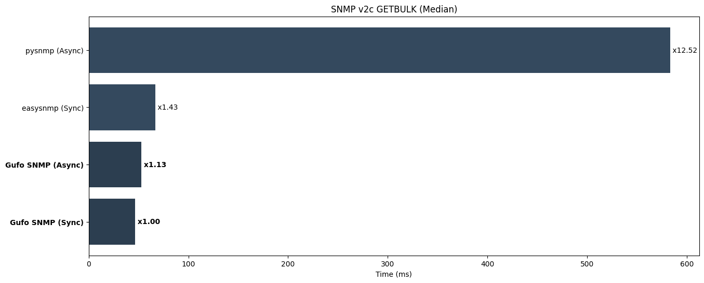

Perform SNMP v2c GETBULK requests to iterate through whole MIB. This test evaluates:

* The efficiency of the network stack.
* The efficiency of BER encoder and decoder.
* The efficiency of the BER-to-Python data types mapping.

Look at the [source code][source] for details.

**Notes**:

* easysnmp doesn't supports async mode

Run tests:

```
pytest benchmarks/test_v2c_getbulk.py
```

**Results (lower is better)**

```
--8<-- "docs/benchmarks/v2c/test_v2c_getbulk.txt"
```


*Lower is better*

[source]: https://github.com/gufolabs/gufo_snmp/blob/master/benchmarks/test_v2c_getbulk.py