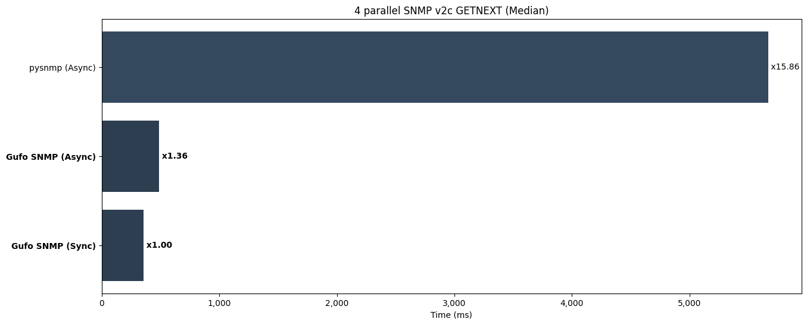

Perform SNMP v2c GETNEXT requests to iterate through whole MIB with concurrency of 4
maintaining single client session per thread/coroutine.

* The efficiency of the network stack.
* The efficiency of BER encoder and decoder.
* The efficiency of the BER-to-Python data types mapping.
* Granularity of the internal locks.
* Ability to release GIL when runnning native code.

Run tests:

```
pytest benchmarks/test_v2c_p4_getnext.py
```

**Results (lower is better)**

```
--8<-- "docs/benchmarks/v2c/test_v2c_p4_getnext.txt"
```


*Lower is better*