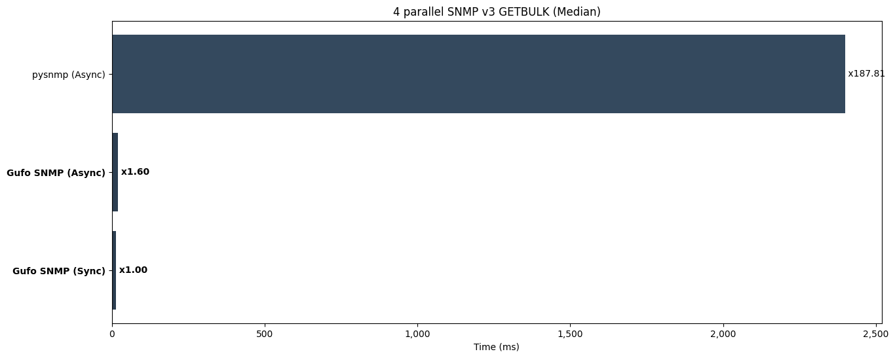

Perform SNMP v3 GETBULK requests to iterate through whole MIB with concurrency of 4
maintaining single client session per thread/coroutine. Use SHA-1 hasing and AES-128 encryption.
This test evaluates:

* The efficiency of the network stack.
* The efficiency of BER encoder and decoder.
* The efficiency of the BER-to-Python data types mapping.
* Granularity of the internal locks.
* Ability to release GIL when runnning native code.

Run tests:

```
pytest benchmarks/test_v3_p4_getbulk.py
```

**Results (lower is better)**

```
--8<-- "docs/benchmarks/v3/test_v3_p4_getbulk.txt"
```


*Lower is better*
