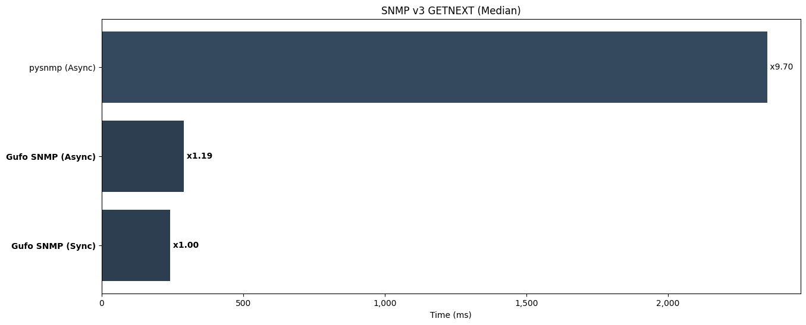

Perform SNMP v3 GETNEXT requests to iterate through whole MIB.
Use SHA-1 hasing and AES-128 encryption. This test evaluates:

* The efficiency of the network stack.
* The efficiency of BER encoder and decoder.
* The efficiency of the BER-to-Python data types mapping.
* The efficiency of the crypto stack.

Run tests:

```
pytest benchmarks/test_v3_getnext.py
```

**Results (lower is better)**

```
--8<-- "docs/benchmarks/v3/test_v3_getnext.txt"
```


*Lower is better*
